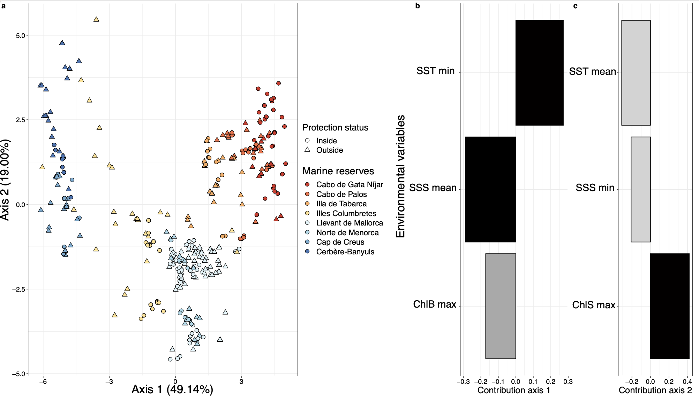

# seascape_reservebenefit

The objective of this project is to dissect the link between **genomics and environmental gradients of differentiation** in a context of conservation of **marine reserves**.
Using a state-of-the-art approach based on seascape genomics, we aim to:

01. Does marine reserve protect genetic diversity ? 
-> Estimating genetic diversity within and outside a network of marine reserve, and testing for significance of the signal
02. Does marine reserve boundaries are linked to a specific genetic background among species ? 
-> Comparing genetic variation distributed across species occupying similar seascape and reserve 
03. Is space, environment or protection that explain the most the genetic varaition observed among species ?
- > Delineating the influence of spatial, protection and environmental gradient on the genetic variation observed
04. Is it better to create new marine reserves or to expand the size of the existing reserves?
-> Bringing useful recommendations for marine reserve design

# 01a-Sampling design
</img>

# 01b-Study design
</img>

# 02-Genetic diversity

## Genetic diversity estimation

**Genetic diversity** is estimated with [Plink1.9](https://www.cog-genomics.org/plink/1.9/basic_stats).
To do so, we  use of the `--het` function that adjust the calculation of observed heterozygosity with sample size. 
We transformed the output obtained from PLINK to observed heterozygosity values - that represents genetic diversity - for each SNP datasets (neutral and adaptive).

## Testing the difference between genetic diversity of individuals sampled inside and outside one of the 8 marine reserves sampled for the project

We want to know the differences of the genetic diversity for each species regarding the category inside/outside a marine reserve.
First, we check the distribution of genetic diversity overall and we test the normality of the distribution using a Shapiro test (`shapito.test()` function).

The observed heterozygosity does not follow normality.
As is highly skew to positive values. It seems like a beta distribution but we will check it later.
First, we perform a Wilcoxon test to compare genetic diversity between samples inside/outside a marine reserve.

#### Neutral genetic diversity inside/outside for the three species

| Species | statistic | p.value |
|--------|--------------------------------------------------|-------------|
| Diplodus sargus | 8817 | 6.01e-1 | 
| Mullus surmuletus | 11424 | 7.42e-1 |
| Serranus cabrilla | 20314 | 1.71e-6 |

#### Adaptive genetic diversity inside/outside for the three species

| Species | statistic | p.value |
|--------|--------------------------------------------------|-------------|
| Diplodus sargus | 8984 | 7.90e-1 | 
| Mullus surmuletus | 11175 | 9.99e-1 |
| Serranus cabrilla | 22082 | 3.50e-4 |

Wilcoxon Signed Rank test revealed that both neutral and adaptive genetic diversity are significantly different for *Serranus cabrilla* but not for *Diplodus sargus** and *Mullus surmuletus*.

</img>

Our predictions are that genetic diversity would be higher in protected areas, such as a marine reserve.
However, here we observe the **opposite trend**. 
We therefore want to further explore the environmental determinant of genetic diversity and identify which determinant can influence genetic diversity in the three species.

# 03-Seascape features

##  Principal components on 24 seascape features that includes salinity, chlorophyll and temperature

We perform a Principal Component Analysis (PCA) on 24 seascape features to avoid collinearity problems.
We keep 3 axes of the PCA based on the Kaiser criterion: keeping component that accounts for at least 5% of the total variance.

</img>

# 03-Seascape genomics models using db-RDA
